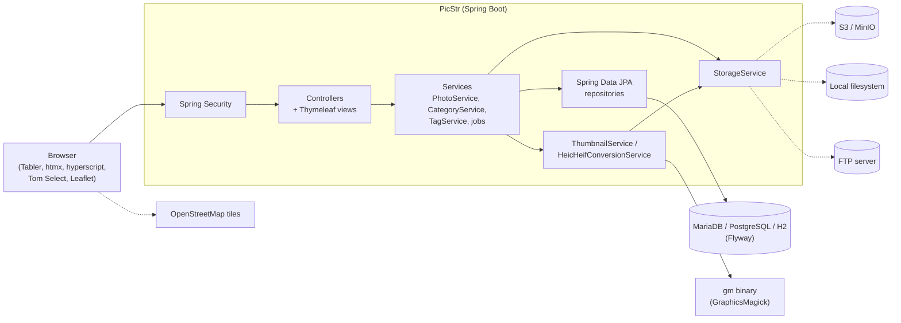
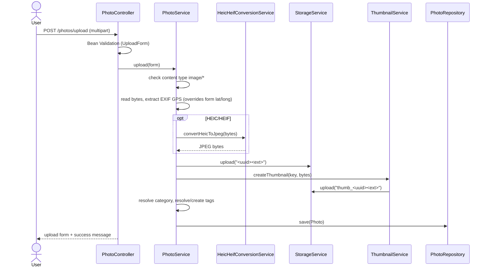
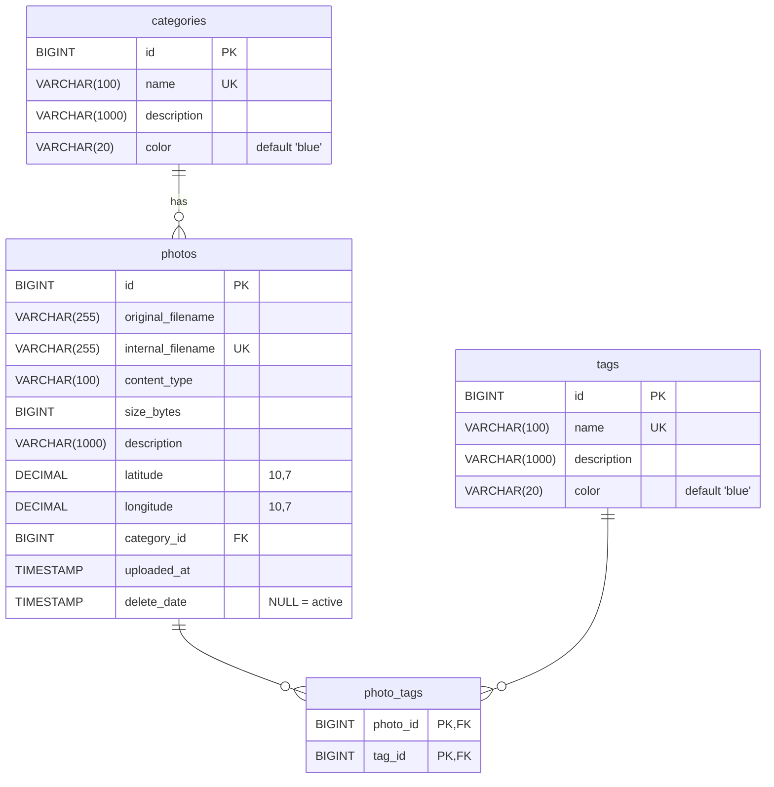

# PicStr — Product & Technical Specification

| | |
|---|---|
| **Version** | 0.2.0-SNAPSHOT |
| **Status** | As-built baseline |
| **Date** | 2026-09-30 |

This document describes what PicStr does and how it is built, as of the version above. Requirements carry stable IDs (`UC-`, `FR-`, `NFR-`, `ISS-`, `RM-`) so issues, pull requests and tests can refer to them. Where the implementation deviates from the intended behaviour, the deviation is recorded in [§11 Known issues](#11-known-issues--roadmap) instead of being silently papered over.

For installation and the full configuration reference, see the [README](../README.md).

## Contents

1. [Overview & goals](#1-overview--goals)
2. [Users & use cases](#2-users--use-cases)
3. [Functional requirements](#3-functional-requirements)
4. [Non-functional requirements](#4-non-functional-requirements)
5. [Architecture](#5-architecture)
6. [Data model](#6-data-model)
7. [HTTP interface](#7-http-interface)
8. [Storage & background jobs](#8-storage--background-jobs)
9. [Security](#9-security)
10. [Configuration & deployment](#10-configuration--deployment)
11. [Known issues & roadmap](#11-known-issues--roadmap)

---

## 1. Overview & goals

PicStr is a mobile-first, self-hosted web application for capturing, storing and organising photos. A user takes a photo in the browser on their phone (or picks a file on a desktop), and the image goes straight to a server-side storage backend. It is never saved to the device's own gallery.

### Goals

| # | Goal |
|---|---|
| G1 | **Privacy.** Photos leave no trace on the capturing device and are stored only on infrastructure the operator controls. |
| G2 | **Accessibility.** Anyone in the organisation can view photos with a web browser; no native app is needed. |
| G3 | **Organisation.** Every photo has exactly one category and any number of tags, shown as colour-coded badges and usable as filters. |
| G4 | **Open and self-hosted.** MIT licensed; runs on common databases and storage backends. |

### Non-goals

- User management, roles and multi-tenancy
- Facial recognition, AI-based categorisation or similar features
- Photo editing (crop, rotate, filters)

### Glossary

| Term | Meaning |
|---|---|
| **Original** | The uploaded image as stored. HEIC/HEIF uploads are stored as their JPEG conversion. |
| **Thumbnail** | A JPEG preview of an original, at most 256×256 px. |
| **Storage key** | The flat string identifying an object in the storage backend. |
| **Internal filename** | The storage key of an original: `<UUID><ext>`, stored in `photos.internal_filename`. |
| **Archive** | Soft delete: the photo gets a `delete_date` and disappears from normal views. It can be restored. |
| **Purge** | Permanent deletion of archived photos (database record and storage files) after the retention period. |
| **Reconciliation** | A background job that brings the database in line with the storage backend. |

---

## 2. Users & use cases

### Personas

| Persona | Description |
|---|---|
| **Field user** | Uses a phone browser to capture and upload photos on site, often with location. |
| **Curator** | Uses a desktop browser to browse, filter, correct metadata and archive photos. |
| **Operator** | Deploys and configures PicStr: database, storage, authentication, jobs. |

All authenticated users have the same permissions (see [§9](#9-security)).

### Use cases

| ID | Use case | Actor | Related requirements |
|---|---|---|---|
| UC-01 | Capture a photo with the phone camera and upload it with category, tags, description and location | Field user | FR-UPL-* |
| UC-02 | Browse the latest photos and the paginated gallery | Curator | FR-GAL-* |
| UC-03 | Filter the gallery by category or tag | Curator | FR-GAL-04, FR-GAL-05 |
| UC-04 | View a photo's details, see it on a map, download the original | Curator | FR-DET-01…04 |
| UC-05 | Edit a photo's filename, description, category, tags and coordinates | Curator | FR-DET-05 |
| UC-06 | Archive a photo, browse the archive, restore a photo | Curator | FR-ARC-* |
| UC-07 | Subscribe to recently uploaded photos via RSS | Any | FR-FEED-* |
| UC-08 | Create, edit and delete categories and tags | Curator | FR-TAX-* |
| UC-09 | Configure database, storage, authentication and jobs | Operator | NFR-02, [§10](#10-configuration--deployment) |

---

## 3. Functional requirements

### 3.1 Upload (UPL)

| ID | Requirement |
|---|---|
| FR-UPL-01 | The upload form (`GET /photos/upload`) offers a file input with `accept="image/*"` and `capture="environment"`, so mobile browsers open the rear camera directly. |
| FR-UPL-02 | The server accepts only files whose content type starts with `image/`. Supported formats are JPEG, PNG, GIF, WebP and HEIC/HEIF. |
| FR-UPL-03 | The maximum file and request size is 20 MB (`spring.servlet.multipart.max-file-size` / `max-request-size`). |
| FR-UPL-04 | HEIC/HEIF files, recognised by a content type containing `heic`/`heif` or a `.heic`/`.heif` extension, are converted to JPEG with GraphicsMagick before storage. They are stored with extension `.jpg` and content type `image/jpeg`. |
| FR-UPL-05 | The original is stored under the key `<random UUID><original extension>`. The user's original filename is kept as metadata. If the browser sends no filename, `capture.jpg` is used. |
| FR-UPL-06 | A thumbnail is generated for every upload: it fits within 256×256 px with the aspect ratio kept, JPEG at quality 85, stored under `thumb_<internal filename>`. |
| FR-UPL-07 | If the image contains EXIF GPS data, latitude and longitude are extracted and **override** any coordinates submitted with the form. |
| FR-UPL-08 | The form has a "use current location" button that fills the read-only latitude/longitude fields from the browser's Geolocation API (7 decimal places). |
| FR-UPL-09 | A category is required. It must already exist and is resolved by ID or name. |
| FR-UPL-10 | Tags are optional. The tag picker (Tom Select) allows up to 5 tags and creating new ones on the fly. Tag names that don't exist yet are created on the server automatically. |
| FR-UPL-11 | The description is optional, at most 1000 characters. |
| FR-UPL-12 | After a successful upload, the form is shown again with a success message, ready for the next photo. |

### 3.2 Gallery (GAL)

| ID | Requirement |
|---|---|
| FR-GAL-01 | The home page (`/`) shows the 8 most recently uploaded non-archived photos and an upload button. |
| FR-GAL-02 | `/photos` shows all non-archived photos, newest first, paginated (default page size 12). |
| FR-GAL-03 | Every paginated view clamps `page` to ≥ 0 and `size` to 1…100. |
| FR-GAL-04 | `/photos/by-category/{name}` filters by category name, case-insensitive (default page size 5). |
| FR-GAL-05 | `/photos/by-tag/{name}` filters by tag name, case-insensitive (default page size 12). |
| FR-GAL-06 | Photos are shown as cards in a responsive grid (1/2/3/4 columns by breakpoint), each with a square thumbnail, a category badge in the category's colour and light tag badges in the tags' colours. Badges link to the matching filter view. |

### 3.3 Detail & edit (DET)

| ID | Requirement |
|---|---|
| FR-DET-01 | `/photos/{id}` shows the photo with its metadata: original filename, content type, size, upload time, category, tags, description, coordinates. |
| FR-DET-02 | The original can be downloaded under its original filename. |
| FR-DET-03 | If both coordinates are set, a Leaflet map with OpenStreetMap tiles (zoom 15, one marker) shows the location. |
| FR-DET-04 | The detail page offers Edit and Archive actions. Archiving asks for confirmation first. |
| FR-DET-05 | `/photos/{id}/edit` lets the user change the original filename (required, ≤ 255), description (≤ 1000), category (required), coordinates and tags (same tag behaviour as FR-UPL-10). |

### 3.4 Archive lifecycle (ARC)

| ID | Requirement |
|---|---|
| FR-ARC-01 | Archiving a photo sets `delete_date` to the current time. Storage files are kept. |
| FR-ARC-02 | Archived photos are excluded from the home page, the gallery, the filter views, the detail page and the RSS feed. |
| FR-ARC-03 | `/photos/archive` lists archived photos, most recently archived first (default page size 20). `/photos/archive/{id}` shows an archived photo's details. |
| FR-ARC-04 | An archived photo can be restored, which clears `delete_date`. |
| FR-ARC-05 | Archived photos older than the retention period (default 30 days) are purged permanently, including their original and thumbnail in storage (see FR-JOB-01). |

### 3.5 Categories & tags (TAX)

Categories and tags behave the same unless noted.

| ID | Requirement |
|---|---|
| FR-TAX-01 | Categories (`/categories`) and tags (`/tags`) can be listed (sorted by name; default page sizes 20 and 10), viewed, created, edited and deleted. |
| FR-TAX-02 | Names are trimmed and stored in lower case. They must be unique regardless of case. Maximum length is 100; **category** names need at least 3 characters. |
| FR-TAX-03 | Each item has a colour from the fixed Tabler palette: `blue`, `azure`, `indigo`, `purple`, `pink`, `red`, `orange`, `yellow`, `lime`, `green`, `teal`, `cyan`. The default is `blue`. |
| FR-TAX-04 | Each item has an optional description (≤ 1000). |
| FR-TAX-05 | A category or tag that is still used by photos (including archived photos) cannot be deleted; the user sees a "still in use" message. |
| FR-TAX-06 | A category named `other` exists from the start (seeded by the initial migration). |

### 3.6 RSS feed (FEED)

| ID | Requirement |
|---|---|
| FR-FEED-01 | An RSS 2.0 feed of the most recent non-archived photos is served at `/feed/recent.xml` and `/feeds/recent.xml`. |
| FR-FEED-02 | The `limit` parameter sets the number of items: default 20, clamped to 1…100. |
| FR-FEED-03 | Each item has the original filename as title, the upload time as publication date, the category, and a link to the photo's thumbnail. |
| FR-FEED-04 | The feed is served with `Cache-Control: no-store`. The layout footer links to it. |

### 3.7 Internationalisation (I18N)

| ID | Requirement |
|---|---|
| FR-I18N-01 | The UI is available in English (default), German, French, Italian, Spanish, Portuguese, Japanese and Simplified Chinese (`messages*.properties`). |
| FR-I18N-02 | The initial language comes from the browser's `Accept-Language` header, matched by language code; English is the fallback. |
| FR-I18N-03 | A language selector in the navigation switches the language with the `?lang=` parameter. The choice is kept in the session. |

### 3.8 Background jobs (JOB)

| ID | Requirement |
|---|---|
| FR-JOB-01 | **Archive purge** permanently deletes archived photos whose `delete_date` is older than `app.photo.archive.retention-days` (default 30). It removes the thumbnail and original from storage, then the database records. Default schedule: daily at 03:00. It is always on. |
| FR-JOB-02 | **Missing-files detection** archives every active photo whose original or thumbnail no longer exists in storage. Default schedule: daily at 04:00. It can be disabled. |
| FR-JOB-03 | **Storage reconciliation** walks every key in storage. For each original with no database record, it creates a photo in category `other`. For each original without a thumbnail, it generates one. Default schedule: daily at 04:15. It can be disabled. |
| FR-JOB-04 | Every schedule is a configurable Spring cron expression (see [§10](#10-configuration--deployment)). |

---

## 4. Non-functional requirements

| ID | Requirement |
|---|---|
| NFR-01 | **Mobile-first UI.** All pages are responsive (Tabler/Bootstrap grid) and usable on a phone. Navigation uses htmx `hx-boost` for fast page transitions. |
| NFR-02 | **Portability.** Runs on MariaDB/MySQL, PostgreSQL or H2, and stores files on S3-compatible storage, a local filesystem or FTP. The backend is chosen by configuration; no code changes are needed. |
| NFR-03 | **Deployment.** Distributed as a container image for `linux/amd64` and `linux/arm64` on `ghcr.io/moser-systems/picstr`. |
| NFR-04 | **Schema management.** The database schema is owned by Flyway migrations. Hibernate never changes the schema (`ddl-auto=none`). |
| NFR-05 | **Security.** Every page except public static resources and assets requires authentication unless it is explicitly turned off (see [§9](#9-security)). |
| NFR-06 | **Resource usage (current behaviour).** An upload is processed on the request thread: EXIF parsing, optional HEIC conversion, storage write and thumbnail generation all run in sequence. Uploaded images and storage reads are held fully in memory; the 20 MB upload limit caps the size of an upload. The missing-files and reconciliation jobs read every object in storage in full. |
| NFR-07 | **Quality gate.** CI runs the test suite on every push and pull request and reports JaCoCo coverage on PRs: at least 40 % overall and 60 % on changed files. |
| NFR-08 | **External runtime dependency.** The GraphicsMagick `gm` binary must be installed for thumbnails and HEIC conversion. The official container image includes it. |

---

## 5. Architecture

### 5.1 Overview

PicStr is a single Spring Boot application that renders HTML on the server. There is no separate frontend application and no JSON API.



Code lives in the package `io.picstr.app`:

| Package | Contents |
|---|---|
| `controller` | MVC controllers. Page controllers extend `BaseController`, which adds `currentUrl` and `activeProfile` to every model. |
| `service` | Business logic, storage backends, image processing, scheduled jobs |
| `repository` | Spring Data JPA repositories |
| `model` | JPA entities `Photo`, `Category`, `Tag` |
| `form` | Form-backing beans with Bean Validation constraints |
| `config` | Security, storage, S3 client, i18n and static-resource configuration |

### 5.2 Choosing implementations by property

Pluggable components are selected with `@ConditionalOnProperty`, not with Spring profiles:

| Interface | Property | Implementations |
|---|---|---|
| `StorageService` | `app.storage.type` | `s3` → `S3StorageService` (+ `S3Config`), `local` → `LocalStorageService` (+ `LocalUploadWebConfig`), `ftp` → `FtpStorageService` |
| `ThumbnailService` | `app.thumbnail.engine` | `graphicsmagick` → `GraphicsMagickThumbnailService` |

Exactly one implementation of each interface must be active, or the application fails to start.

### 5.3 Technology stack

| Layer | Technology |
|---|---|
| Language / runtime | Java 25 (Eclipse Temurin) |
| Framework | Spring Boot 4.1 (Web MVC, Security, OAuth2 Client, Data JPA, Validation) |
| Persistence | Hibernate; Flyway 12 migrations |
| Views | Thymeleaf + Thymeleaf Layout Dialect |
| Frontend | Tabler UI, htmx, hyperscript, Tom Select, Leaflet |
| Image processing | im4java → GraphicsMagick; metadata-extractor (EXIF/GPS) |
| Storage clients | AWS SDK v2 (S3), Apache Commons Net (FTP) |
| Feed | ROME |
| Build | Maven wrapper; frontend-maven-plugin (Node/npm) |
| Boilerplate | Lombok |

### 5.4 Upload flow



`PhotoService.upload` is `@Transactional`. The storage writes are not part of that transaction: if saving the record fails, the files stay in storage, and the next reconciliation run will pick them up (FR-JOB-03).

### 5.5 Frontend assets

Third-party JavaScript and CSS come from npm (`package.json`). `build.mjs` copies them into `src/main/resources/static/vendor/`. The Maven build runs `npm install` and `npm run build` automatically through the frontend-maven-plugin. Templates live in `src/main/resources/templates/`, with `layout.html` as the shared page layout.

---

## 6. Data model



| Table | Notes |
|---|---|
| `categories`, `tags` | `name` is NOT NULL and UNIQUE; the application also stores it lower-cased. `color` is NOT NULL. |
| `photos` | Everything except `description`, `latitude`, `longitude` and `delete_date` is NOT NULL. `internal_filename` is unique and is the storage key of the original. `uploaded_at` is set when the record is first saved. |
| `photo_tags` | Many-to-many join table with a composite primary key. |

- Foreign keys have no `ON DELETE` actions, which is what prevents deleting a category or tag that is still in use (FR-TAX-05).
- The only indexes are those created by primary keys, unique constraints and foreign keys.
- `Photo` loads its category and tags eagerly.

### Migrations

- Location: `src/main/resources/db/migration/{h2,mariadb,postgresql}/`, chosen by Flyway's `{vendor}` placeholder. Flyway's history table is `migrations`.
- The three V1 scripts differ only in how IDs are generated (`AUTO_INCREMENT`, `GENERATED BY DEFAULT AS IDENTITY`, `BIGSERIAL`).
- **Rule:** every schema change needs a migration in all three directories. Tests run on H2 in MariaDB mode with `ddl-auto=validate`, so the entities must match the H2 schema.

---

## 7. HTTP interface

All endpoints return HTML views or redirects, except the feed (XML) and assets (binary). Paginated endpoints take `page` (0-based) and `size`, clamped as described in FR-GAL-03.

### 7.1 Photos

| Method | Path | Parameters | Result |
|---|---|---|---|
| GET | `/` | — | Home page with latest 8 photos |
| GET | `/photos` | `page`, `size`=12 | Gallery |
| GET | `/photos/upload` | — | Upload form |
| POST | `/photos/upload` | multipart `UploadForm` | Upload form again, with success or error message |
| GET | `/photos/{id}` | — | Detail. Not found → redirect `/` with error |
| GET | `/photos/{id}/edit` | — | Edit form |
| POST | `/photos/{id}` | `PhotoUpdateForm` | Redirect to `/photos/{id}`. Validation errors → edit form again |
| POST | `/photos/{id}/archive` | — | Redirect `/` |
| GET | `/photos/by-category/{category}` | `page`, `size`=5 | Filtered gallery |
| GET | `/photos/by-tag/{tag}` | `page`, `size`=12 | Filtered gallery |
| GET | `/photos/archive` | `page`, `size`=20 | Archive list |
| GET | `/photos/archive/{id}` | — | Archived photo detail. Not found → redirect `/photos/archive` |
| POST | `/photos/{id}/restore` | `redirect` (default `/photos/archive`) | Redirect to `redirect` |

### 7.2 Categories and tags

`{base}` is `/categories` or `/tags`.

| Method | Path | Result |
|---|---|---|
| GET | `{base}` | List (`page`, `size`: 20 for categories, 10 for tags) |
| GET | `{base}/new` | Create form |
| POST | `{base}` | Create, then redirect to the list |
| GET | `{base}/{id}` | Detail |
| GET | `{base}/{id}/edit` | Edit form |
| POST | `{base}/{id}` | Update, then redirect |
| POST | `{base}/{id}/delete` | Delete, then redirect. Still in use → "still in use" error |

### 7.3 Feed and assets

| Method | Path | Result |
|---|---|---|
| GET | `/feed/recent.xml`, `/feeds/recent.xml` | RSS 2.0 (`application/rss+xml`), `limit`=20 (1…100) |
| GET | `/assets/{key}` | The stored object. Content type comes from storage (fallback `application/octet-stream`), with `Content-Length` and `Cache-Control: max-age=86400, public`. Keys containing `..` or `\`, or starting with `/` or `file:`, return 404, as do missing objects. |

### 7.4 Forms and validation

| Form | Constraints |
|---|---|
| `UploadForm` | `image` required; `category` not blank; `description` ≤ 1000; `latitude`/`longitude` free text, must parse as decimals; `tags` list |
| `PhotoUpdateForm` | `originalFilename` not blank, ≤ 255; `category` not blank; `description` ≤ 1000; coordinates and tags as above |
| `CategoryForm` | `name` 3…100; `description` ≤ 1000; `color` required, from the palette (FR-TAX-03) |
| `TagForm` | `name` ≤ 100, not blank; `description` ≤ 1000; `color` required, from the palette |

### 7.5 Flash messages

Controllers pass `success`/`error`/`info`/`warning` flash attributes. If a value starts with `msg.`, the layout looks it up in the message bundle; otherwise it shows the text as is (for example, exception messages from services).

---

## 8. Storage & background jobs

### 8.1 Storage contract

```java
public interface StorageService {
    void upload(String key, InputStream content, long contentLength, String contentType);
    Optional<StorageObject> get(String key);   // StorageObject(content, contentLength, contentType)
    List<String> listKeys();
    void delete(String key);
}
```

### 8.2 Key convention

| Object | Key |
|---|---|
| Original | `<UUID><ext>`, for example `3f2c…e1.jpg` (= `photos.internal_filename`) |
| Thumbnail | `thumb_<internal filename>`, for example `thumb_3f2c…e1.jpg`. It always contains JPEG data, whatever the extension. |

The jobs treat every key that does not start with `thumb_` as an original. **Do not store any other objects in the PicStr bucket or directory**: reconciliation would import them as photos.

### 8.3 Backends

| Backend | Behaviour |
|---|---|
| **S3** (`s3`, default) | AWS SDK v2 with static credentials, an optional endpoint override (for MinIO, Ceph and so on) and path-style access (on by default; turn it off for AWS). `listKeys` lists the whole bucket. A missing key returns empty. |
| **Local** (`local`) | Files under `app.storage.local.base-path`. `get` and `delete` normalise the path and reject anything outside the base directory. `listKeys` walks the directory recursively and returns relative paths with `/`. The content type is guessed from the file. |
| **FTP** (`ftp`) | Apache Commons Net, binary mode, a new connection and login for every operation. Files live in `app.storage.ftp.base-path`, which is created if missing (one level only). `listKeys` is flat (no subdirectories). The content type is guessed from the filename. |

### 8.4 Jobs

Scheduling is enabled application-wide (`@EnableScheduling`).

| Job | Class | Default cron | Enable flag | Reads | Writes |
|---|---|---|---|---|---|
| Archive purge | `ArchivedPhotoPurgeJob` | `0 0 3 * * *` | — (always on) | photos with `delete_date` before now − retention | deletes storage objects, then DB rows |
| Missing-files detection | `MissingStorageFilesDetectionJob` | `0 0 4 * * *` | `app.photo.missing-files.detection-enabled` | every active photo; `get` on original and thumbnail | sets `delete_date` |
| Storage reconciliation | `StoragePhotoReconciliationJob` | `0 15 4 * * *` | `app.photo.reconcile.enabled` | `listKeys()`; every original | new `Photo` rows (category `other`); missing thumbnails |

In the `dev` profile, all three jobs run **every second** and the retention period is 1 day.

---

## 9. Security

### 9.1 Authentication modes

`app.security.auth-mode` (`APP_SECURITY_AUTH_MODE`):

| Mode | Behaviour |
|---|---|
| `basic` (default) | HTTP Basic authentication. PicStr configures no users, so Spring Boot's default user applies: `user`, with a password generated at startup unless `spring.security.user.*` is set. |
| `oauth2` | OAuth2/OpenID Connect login. Needs `spring.security.oauth2.client.registration.*`; startup fails without it. `application-oidc-microsoft.properties` is an example profile for Microsoft Entra ID (`OIDC_CLIENT_ID`, `OIDC_CLIENT_SECRET`, `OIDC_TENANT_ID`). |
| `none` | All endpoints are public. For development only; the `dev` profile uses it. |

Any other value makes startup fail.

### 9.2 Authorisation

- Public in `basic`/`oauth2` modes: `/assets/**`, `/vendor/**`, root-level `*.ico`, `*.png`, `*.jpg`, `*.svg`, `*.txt`, `/site.webmanifest`, `/login**`, `/error**`.
- Everything else requires an authenticated user.
- There are no roles: every authenticated user can upload, edit, archive, restore and manage categories and tags (consistent with the non-goals).
- CSRF protection is **disabled** in all modes.

### 9.3 Asset access

`/assets/**` is public so that thumbnails and originals can be embedded and linked (for example, from the RSS feed) without authentication. Storage keys are random UUIDs, so they can't be guessed, but anyone who has a URL can open it — including URLs of archived photos (ISS-05).

---

## 10. Configuration & deployment

### 10.1 Key settings

Every property can also be set as an environment variable. See the [README](../README.md#configuration-reference) for the complete list and examples.

| Area | Property | Env var | Default |
|---|---|---|---|
| Database | `spring.datasource.url` | `DB_URL` | `jdbc:mariadb://localhost:3306/picstr2?createDatabaseIfNotExist=true` |
| | `spring.datasource.username` / `password` | `DB_USER` / `DB_PASSWORD` | `picstr` / `picstr` |
| Storage | `app.storage.type` | `APP_STORAGE_TYPE` | `s3` |
| | `app.storage.s3.*` | `APP_STORAGE_S3_*` | endpoint `http://localhost:9000`, region `eu-central-1`, bucket `picstr-images` |
| | `app.storage.local.base-path` | `APP_STORAGE_LOCAL_BASE_PATH` | `./data/uploads` |
| | `app.storage.ftp.*` | `APP_STORAGE_FTP_*` | host `localhost`, port 21, base path `/uploads` |
| Images | `app.thumbnail.engine` | `APP_THUMBNAIL_ENGINE` | `graphicsmagick` |
| | `app.thumbnail.gm.search-path` | `APP_THUMBNAIL_GM_SEARCH_PATH` | `/usr/bin` |
| Auth | `app.security.auth-mode` | `APP_SECURITY_AUTH_MODE` | `basic` |
| Jobs | `app.photo.archive.retention-days` | `APP_PHOTO_ARCHIVE_RETENTION_DAYS` | `30` |
| | `app.photo.archive.purge-cron` | `APP_PHOTO_ARCHIVE_PURGE_CRON` | `0 0 3 * * *` |
| | `app.photo.missing-files.detection-enabled` / `-cron` | `APP_PHOTO_MISSING_FILES_DETECTION_ENABLED` / `_CRON` | `true` / `0 0 4 * * *` |
| | `app.photo.reconcile.enabled` / `.cron` | `APP_PHOTO_RECONCILE_ENABLED` / `_CRON` | `true` / `0 15 4 * * *` |
| Uploads | `spring.servlet.multipart.max-file-size` / `max-request-size` | — | `20MB` |

### 10.2 Profiles

| Profile | Purpose |
|---|---|
| *(none)* | Production defaults as above |
| `dev` | Local storage, `auth-mode=none`, jobs every second, 1-day retention. Database login `root`/`root` unless overridden. |
| `oidc-microsoft` | Example OIDC setup for Microsoft Entra ID; turns on Spring Security DEBUG logging |

### 10.3 Build & container

- `./mvnw clean package` builds the executable jar, including the frontend assets.
- `Dockerfile.multistage` builds the jar with `maven:3-eclipse-temurin-25` (tests skipped) and runs it on `eclipse-temurin:25-jre-alpine` with `graphicsmagick` installed. The image exposes port 8080.
- `docker-compose.yml` is an example stack.

### 10.4 CI/CD (GitHub Actions)

| Workflow | Trigger | What it does |
|---|---|---|
| `test.yml` | every push and pull request | `./mvnw test` on Java 25; JaCoCo coverage comment on PRs (NFR-07) |
| `container.yml` | push to `main`, tags `v*` | Builds `Dockerfile.multistage` for amd64 and arm64 and pushes to `ghcr.io/moser-systems/picstr`. Tags: branch name (`main`), `{{version}}`, `{{major}}.{{minor}}` (and `latest` on version tags). |

Dependabot keeps Maven, npm, Docker and GitHub Actions dependencies up to date.

---

## 11. Known issues & roadmap

### 11.1 Known issues

These are differences between the intended behaviour and the current code, checked against the source.

| ID | Area | Issue |
|---|---|---|
| ISS-01 | Security | **Open redirect.** `POST /photos/{id}/restore` redirects to whatever `redirect` parameter it gets (`PhotoController.restore`). Because CSRF is disabled, a third-party page can trigger it. |
| ISS-02 | Jobs | **Purge order and join table.** `PhotoService.purgeArchivedOlderThanDays` deletes storage files first and then calls `deleteAllInBatch`. That bulk delete most likely skips the `photo_tags` rows, so purging a tagged photo would fail on the foreign key and leave a record whose files are already gone. Contradicts FR-JOB-01. |
| ISS-03 | Feed | `FeedController` calls `Date.from(photo.getUploadedAt())` before its null check. A photo without `uploaded_at` would break the feed. |
| ISS-04 | Storage | `LocalStorageService.upload` has no path-traversal check; `get` and `delete` do. Keys are server-generated today, so it can't be exploited now, but the contract isn't enforced. |
| ISS-05 | Security | Archived photos are hidden from every view (FR-ARC-02), but their files remain publicly reachable under `/assets/`. |
| ISS-06 | Upload | The upload POST shows the form again instead of redirecting, so refreshing the browser can submit the same upload twice. |
| ISS-07 | Upload | The 5-tag limit (FR-UPL-10) is enforced only in the browser. |
| ISS-08 | UX | Defaults are inconsistent: the category filter uses page size 5, the other galleries 12; category names need 3 characters, tag names 1. |
| ISS-09 | UI | Tabler theme CSS is loaded, but the theme script isn't included and there is no toggle, so there's no working dark mode. The PWA manifest has empty `name`/`short_name` and no `start_url`. |
| ISS-10 | Build | `Containerfile` copies `target/app.jar`, but the pom sets no `finalName`, so the jar is called `picstr-<version>.jar`; the image also lacks GraphicsMagick. The `Makefile` calls `npm run css-build`, which doesn't exist. |
| ISS-11 | Storage | A thumbnail key keeps the original's extension (for example `thumb_x.png`) although the content is always JPEG. |
| ISS-12 | Security | In `oauth2` mode the login page is set to `/login`, but PicStr has no controller or template for it. Spring Security then doesn't generate its default login page, so `/login` probably returns an error page instead of the provider link. |
| ISS-13 | Operations | There is no health endpoint (no Spring Boot Actuator) for container orchestration. |
| ISS-14 | Docs | The README describes a gallery "map view"; only the per-photo map on the detail page exists. The default database name in `application.properties` is `picstr2`, while the README uses `picstr`. |

### 11.2 Roadmap

| ID | Item | Source |
|---|---|---|
| RM-01 | Bulk upload and bulk management (multi-select archive, re-categorise, tag) | README |
| RM-02 | Search by filename, description, category, tags and GPS coordinates | README |
| RM-03 | API endpoints for integration with other applications and mobile clients | README |
| RM-04 | Gallery-wide map view of all geotagged photos | Gap (ISS-14) |
| RM-05 | Health and readiness endpoints | Gap (ISS-13) |
